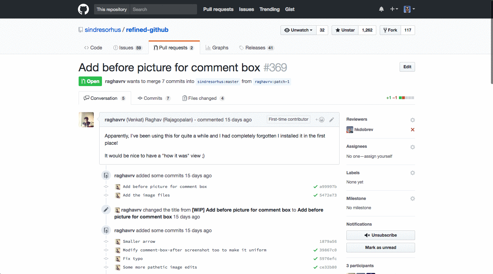

# Git Git Hooray

Celebrate first time contributors on GitHub! Click on the new "First-time contributor" `span` to add a dash of emoji sprinkles to the page! 🎉

# Installation

Install it from the [Chrome Web Store](https://chrome.google.com/webstore/detail/git-git-hooray/hdonhjpoakhlbpmehiogeaknnfdlgnad) or [manually](http://superuser.com/a/247654/6877).

# Contributing

Contributions are more than welcome!

1. Fork the repo.
2. Make a branch.
3. Push your changes.
4. Open a PR!

To check your local changes as you make them, [load the unpacked extension in Chrome](https://developer.chrome.com/extensions/getstarted#unpacked).

# License

MIT © [Paul Molluzzo](https://paul.molluzzo.com)
